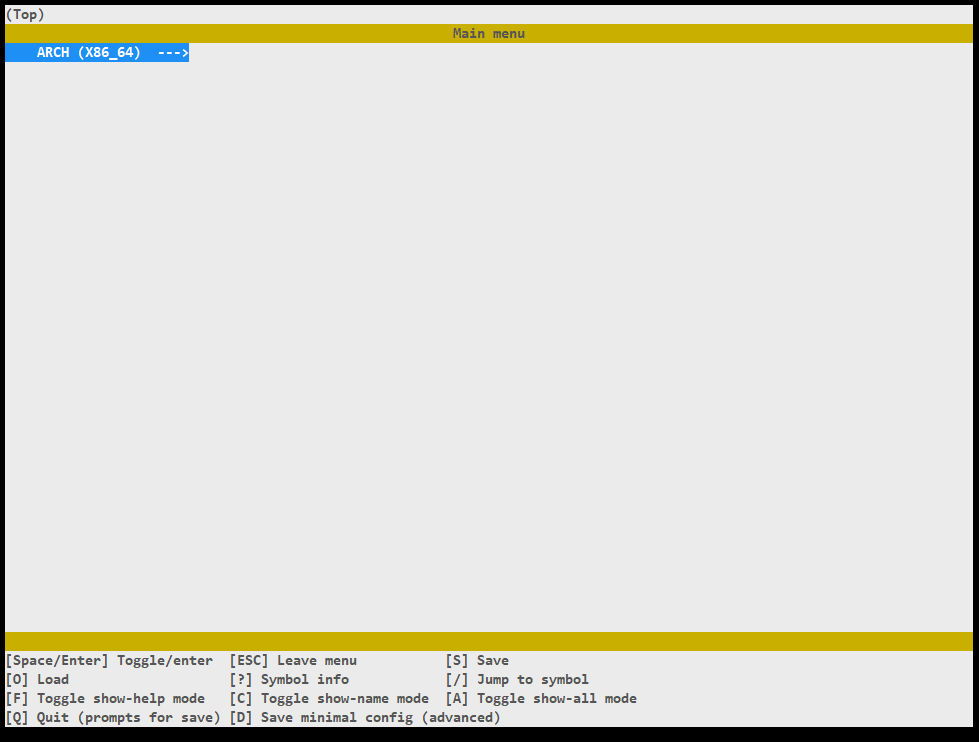

# rpm自举脚本

# 简介

[https://github.com/fedora-riscv/bootstrap](https://github.com/fedora-riscv/bootstrap)

为了实现 Fedora 自举，写了一个脚本快速完成 stage1（构建交叉编译器） 和 stage2（构建最小系统），并且安装 rpm 和前置依赖

支持多架构，使用 make menuconfig 即可调整，未来也许还能支持可选包



# 第一阶段

第一阶段要编译出来 target=$ARCH 的编译工具链（binutils+gcc+glibc）

## binutils

这个编译十分顺利，为了避免污染源码目录，创建一个 build 目录，然后

```bash
../configure --target=$ARCH --prefix=$PREFIX --with-sysroot=$PREFIX \
             --disable-multilib --disable-nls
make && make install
```

其中为了只编译某个特定架构，所以 disable-mutilib，另外多语言目前也是没必要的，所以也 disable-nls

## gcc

因为编译时还没有 $ARCH 架构的 glibc，所以这个阶段的 gcc 不能直接编译，参考了许多资料之后

```bash
../configure --target=$ARCH --prefix=$PREFIX --with-sysroot=$PREFIX \
             --disable-multilib --disable-nls --disable-shared --disable-threads \
             --disable-bootstrap --enable-languages=c --with-newlib
make all-gcc all-target-libgcc
make install-strip-gcc install-strip-target-libgcc
```

其中 disable-bootstrap（因为如果你在某种架构中，如果目标架构也一样的话，那么就会自动开启自举，这时候是会出错的）

然后也只开启了 C 语言的支持，因为这时候没有基础环境，所以 libstdc++ 会构建失败

另外也因为没有 glibc，所以要启用内置的 newlib，避免之后构建找不到 libc 需要的代码

其中 all-gcc all-target-libgcc 也是为了避免构建别的东西，目前没有 glibc 构建不起来，所以只构建 gcc 和 libgcc 就可以了

## linux-headers

构建 glibc 需要的，直接

```bash
linuxarch=""
case $ARCH in
    riscv*)
        linuxarch="riscv"
        ;;
    x86_64*)
        linuxarch="x86_64"
        ;;
    x86*)
        linuxarch="x86"
        ;;
    aarch64*)
        linuxarch="aarch64"
        ;;
    armv7hl*)
        linuxarch="arm"
        ;;
    *)
        linuxarch=""
        ;;
esac

make mrproper
make ARCH=$linuxarch INSTALL_HDR_PATH=$PREFIX/usr headers_install
```

需要注意的是，因为 Linux 使用的 ARCH 不是编译三元组的格式，所以用 case in 转换一下

## glibc

因为之前已经编译出来一个 gcc 青春版（？），所以这一步直接编译 glibc 没问题

```bash
export CC=$ARCH-gcc
export CXX=$ARCH-gcc
../configure --host=$ARCH --prefix=/usr --with-headers=$PREFIX/usr/include \
             libc_cv_slibdir=/usr/lib
make && make DESTDIR=$PREFIX install
```

其中因为 glibc 会调用 $CXX，而因为上一步没有编译 libstdc++，所以也把 CXX 重定向到 gcc

这一步不同于之前，使用 prefix=/usr 然后再指定 DESTDIR 安装到我们的工具目录（因为想把工具链和 glibc 合并到一块）

另外 with-headers 引用之前安装的 linux-headers（听说可以有优化加成）

因为我们现在是把工具链和 glibc 合并到一块，所以要指定 libc_cv_slibdir 把 glibc 的 lib 都固定到 /usr/lib，否则某些架构 glibc 只会安装到 /usr/lib64，而 gcc 又去 /usr/lib 找 glibc，这样就会踩坑

## gcc 完整版

上面已经编译完 glibc，所以可以直接正常流程编译 gcc 了，直接重新编译覆盖掉之前的版本

```bash
../configure --target=$ARCH --prefix=$PREFIX --with-sysroot=$PREFIX \
             --disable-multilib --disable-nls --disable-bootstrap --enable-languages=c,c++
make && make install
```

# 第二阶段

第一阶段构建的工具链足够齐全了，所以可以再编译 host=$ARCH 的工具链，这样的话当我们之后构建出最小系统以后，别的组件就可以在最小系统内自给自足了

PS：为了便捷期间，依旧采用 $PREFIX 变量，但和第一阶段的 $PREFIX 不一样，不要把这些组件编译到工具链之中

## rootfs

为了简化系统结构，并且之后避免某些软件抱怨，创建了一些必要的文件和软链接

```bash
mkdir -p $PREFIX/{etc,root,proc,sys,dev,tmp}
mknod $PREFIX/dev/null c 1 3
mknod $PREFIX/dev/zero c 1 5
mknod $PREFIX/dev/random c 1 8
mknod $PREFIX/dev/urandom c 1 9
echo "nameserver 1.1.1.1" > $PREFIX/etc/resolv.conf

mkdir -p $PREFIX/usr/{bin,sbin,lib,lib64}
ln -sf usr/bin $PREFIX/bin
ln -sf usr/sbin $PREFIX/sbin
ln -sf usr/lib $PREFIX/lib
ln -sf usr/lib64 $PREFIX/lib64
```

## binutils & gcc & glibc

第一阶段工具链没问题的话，这一步直接当正常编译就可以了，没什么特殊的

```bash
# binutils
../configure --host=$ARCH --prefix=/usr --with-build-sysroot=$PREFIX \
             --disable-multilib --disable-nls
make && make DESTDIR=$PREFIX install
```

需要注意之后为了 chroot 进最小系统，所以不能再 with-sysroot，否则 chroot 进之后原路径就会失效，只能在编译时临时使用这个 sysroot，以达到能够编译出结果

也是因为之后 chroot 才会用到这个工具链，所以 prefix 指定到 /usr 避免进去之后找不到文件

```bash
# glibc
../configure --host=$ARCH --prefix=/usr --with-headers=$PREFIX/usr/include
make
make DESTDIR=$PREFIX install
make DESTDIR=$PREFIX SUPPORTED-LOCALES=en_US.UTF-8/UTF-8 localedata/install-locales
```

比之前多了一个 localedata/install-locales 的构建，因为之后 Perl 会抱怨系统没有 locale 怎么怎么样

```bash
# gcc
../configure --host=$ARCH --target=$ARCH --prefix=/usr --with-build-sysroot=$PREFIX \
             --disable-multilib --disable-nls --disable-bootstrap --enable-languages=c,c++
make && make DESTDIR=$PREFIX install
```

## GNU 全家桶

这一步没什么繁琐的，但是十分麻烦，需要下载许多包并且安装

我目前安装了 coreutils diffutils findutils gawk grep gzip xz tar m4 patch sed file bash make wget

其中安装 bash 是为了之后继续能执行这个脚本（因为脚本用到了许多 bash 的特性）

安装 make 也是避免 chroot 之后要 make make 的麻烦

安装 wget 为了 chroot 之后可以自己下包自己编包，完全自给自足

许多组件都没什么特别的，所以就不给具体命令了，只给特殊的

## coreutils

默认不带 hostname，会被之后许多软件抱怨，所以需要手动加上

```bash
../configure --host=$ARCH --prefix=/usr --enable-install-program=hostname
make && make DESTDIR=$PREFIX install
```

## wget

因为这一阶段最小系统内还没有 OpenSSL，也没有 zlib 和 pcre2，所以 wget 需要先去掉这些支持，https 也暂时禁用掉

```bash
../configure --host=$ARCH --prefix=/usr --with-ssl=no --without-zlib --disable-pcre2
make && make DESTDIR=$PREFIX install
```

## chroot

在安装 qemu-user 的情况下，直接把 qemu-user-$ARCH 给复制到我们的 sysroot 根目录，然后再用 chroot 调用 qemu，qemu再调用 /bin/bash 进入 sysroot，以 riscv32 为例

```bash
cp $(qemu-riscv32-static) $PREFIX
chroot $PREFIX /qemu-riscv32-static /bin/bash
```

# 第三阶段

其实实际第三阶段应该是用 rpm 开始编包，但是因为我写的是脚本，为了方便编写起见，把 chroot 之后安装 rpm 及其前置依赖也分为一个阶段，实际情况下本阶段仍然属于第二阶段

## zlib & Perl & OpenSSL & wget

刚刚因为安装的 wget 是去掉了许多依赖，为了加回来，先安装 zlib 和 OpenSSL，而 OpenSSL 又要依赖 Perl

接下来有许多包下载都是强制 https，这对完全自给自足来说就是个障碍，所以也需要先装这四个

而这四个包站点正好可以用一些手段不跳转到 https

```bash
# zlib
# http://www.zlib.net/zlib-1.2.13.tar.xz
CHOST=$ARCH ../configure --prefix=/usr
make && make install
```

zlib 要加一个 CHOST，否则它识别不到现在是什么架构

```bash
# Perl
# http://www.cpan.org/src/5.0/perl-5.36.1.tar.gz
./Configure -des -Dprefix=/usr
make && make install
```

Perl 直接在源码根目录编译了，没有创建 build 再编译

```bash
# OpenSSL
# http://ftp.openssl.org/source/openssl-3.1.1.tar.gz
../config --prefix=/usr --openssldir=/etc/ssl shared
make && make install
ldconfig
```

从这一步开始要多用 ldconfig，因为编的包有许多库，避免之后编包找不到 .so 被影响

```bash
# wget
http://ftpmirror.gnu.org/gnu/wget/wget-1.21.4.tar.gz
../configure --host=$ARCH --prefix=/usr --with-ssl=openssl \
             OPENSSL_CFLAGS="-I/usr/include" OPENSSL_LIBS="-lssl -lcrypto"
make && make install
wget --no-check-certificate https://curl.haxx.se/ca/cacert.pem -O /etc/ssl/cert.pem
```

因为这时候还没有 pkg-config，所以为了 wget 识别到已经安装的 OpenSSL，就需要手动指定这些变量了

最后下载常见的可信任证书到 /etc/ssl/cert.pem

## rpm

rpm 有许多前置依赖，这里我做了一张图，其中有许多是当前已经编译好的依赖


推荐先编译 pkg-config，这样后面的依赖可以不用指定特殊的参数

而 pkg-config 因为依赖 glib，为了方便可以使用它内置的

```bash
../configure --build=$ARCH --prefix=/usr --with-internal-glib
make && make install
```

另外 rpm 官方源码包使用极其反人类的 .tar.bz2 打包格式，所以还需要再装一个 bzip2

因为 bzip2 没有 configure，所以直接执行 make 就可以了

```bash
make clean
make -f Makefile-libbz2_so
make install
```

其中 lua 的技巧很多，没有 configure，甚至 ROOT 是写死的……需要先对源码修改为正确的安装路径

```bash
sed -i '/#define LUA_ROOT/s:/usr/local/:/usr/:' src/luaconf.h
make MYCFLAGS="-fPIC" linux -j$J
make INSTALL_TOP=/usr install
```

另外需要手动写一个 pkg-config 文件以便其他包可以识别到 lua

```bash
cat > /usr/lib/pkgconfig/lua.pc << "EOF"
V=5.4
R=5.4.6

prefix=/usr
INSTALL_BIN=${prefix}/bin
INSTALL_INC=${prefix}/include
INSTALL_LIB=${prefix}/lib
INSTALL_MAN=${prefix}/share/man/man1
INSTALL_LMOD=${prefix}/share/lua/${V}
INSTALL_CMOD=${prefix}/lib/lua/${V}
exec_prefix=${prefix}
libdir=${exec_prefix}/lib
includedir=${prefix}/include

Name: Lua
Description: An Extensible Extension Language
Version: ${R}
Requires:
Libs: -L${libdir} -llua -lm -ldl
Cflags: -I${includedir}
EOF
```

## gettext & curl & git

为了之后能拉到 git 的包，所以安装了 git

其中 curl 需要指定一下证书路径

```bash
../configure --prefix=/usr --with-openssl --with-ca-bundle=/etc/ssl/cert.pem
make && make install
```

## help2man & rpmdevtools

rpmdevtools 提供了许多实用工具，所以很有必要装这个，方便之后操作

其中 rpmdevtools 不仅仅需要 help2man，还有两个 python 依赖

```bash
pip install progressbar2 requests
../configure --prefix=/usr
make && make install
```

# 工具

上面介绍的包有许多技巧，而且整个流程走下来时间耗费也很大，为了自动化这一切，所以有了本项目

## pkg

为了应对每个包不同的参数，以及不同的环境，我写了一个简单的包管理

可以自动分析依赖完成编译的前后顺序，也能自动调用系统下载源码并校验

每个包有变量描述，也有准备、编译和安装阶段的函数，类似如下

```bash
PKGNAME=rpm
PKGVER=4.18.1
URL="https://ftp.osuosl.org/pub/rpm/releases/rpm-4.18.x/rpm-$PKGVER.tar.bz2"
SOURCE=${URL##*/}
SHA256SUM=37f3b42c0966941e2ad3f10fde3639824a6591d07197ba8fd0869ca0779e1f56
DEPENDS=(zlib pkg-config libgpg-error libgcrypt popt libarchive sqlite lua python)

EXTRACT() {
    local src=$1
    if [ ! -f configure ]; then
        tar --strip-components 1 -xf $src
    fi
}

PREPARE() {
    rm -rf build1 && mkdir -p build1
    pushd build1
    ../configure --prefix=/usr --enable-python
    popd
}

BUILD() {
    pushd build1
    make -j$J
    popd
}

INSTALL() {
    pushd build1
    make install -j$J
    popd
}

POST() {
    echo "mockbuild:x:1000:1000:::/bin/rpm" >> /etc/passwd
    echo "mock:x:135:mockbuild" >> /etc/group
    echo "127.0.0.1 $(hostname)" >> /etc/hosts
}
```

所以本工具的思想就是，把一些通过 pkg 描述的包堆放到 /packages 目录下，然后 Makefile 中指定每个阶段需要用到哪些包，再软链接过去，然后调用工具分析并逐个编译

```makefile
ROOT=$(realpath $(dir $(lastword $(MAKEFILE_LIST))))

stage2: stage1 config.sh
	@mkdir -p $(ROOT)/stage2
	@ln -sf ../packages/base/{rootfs,m4,coreutils,diffutils,findutils} $(ROOT)/stage2/
	@ln -sf ../packages/base/{gawk,grep,gzip,xz,tar,patch,sed,file,bash,make,wget-lite} $(ROOT)/stage2/
	@ln -sf ../packages/toolchains/{linux-headers,binutils,glibc,gcc} $(ROOT)/stage2/
  @bash -e build.sh "" 2
```

## 使用方法

下载到工具之后，执行 make menuconfig 调整配置，然后执行 make 即可自动完成 stage1 和 stage2 阶段（分别会生成工具目录下的 tools 和 sysroot）

在完成 stage2 阶段之后，会将自身复制到 sysroot，方便之后继续 stage3 阶段

手动 chroot 进 sysroot 之后，进入 /bootstrap 目录，执行 make stage3 即可继续（完成 rpm & rpmdevtools & git 的自动化编译安装）
